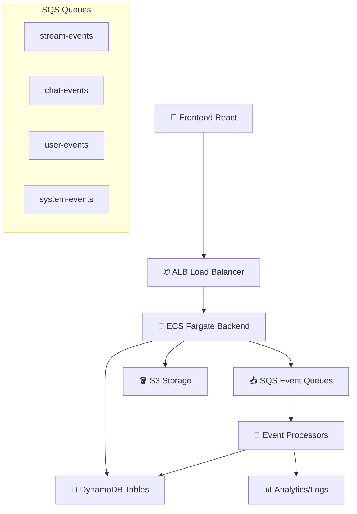

# 🚀 Stream Project - Full Stack Live Streaming Platform

Um projeto completo de streaming ao vivo com chat em tempo real, desenvolvido com NestJS (backend) e React (frontend), utilizando arquitetura event-driven com SQS e infraestrutura ECS.

## 📋 Pré-requisitos

Antes de começar, certifique-se de ter instalado### Problema: ECS demora para criar

**✅ ISSO É NORMAL!** O ECS demora no LocalStack Pro (~2-3 minutos).

```bash
# Seja paciente - logs mostrarão progresso
cd backend && npm run dev:full
```ersão 18+)
- **Docker** e **Docker Compose**
- **LocalStack Pro** (para simulação completa dos serviços AWS)
- **Terraform** (versão 1.6+)
- **AWS CLI** (opcional, para testes)

> ⚠️ **LocalStack Pro Required**: Este projeto usa recursos avançados como ECS/Fargate que requerem LocalStack Pro. Com LocalStack Community, apenas DynamoDB, S3 e SQS funcionarão adequadamente.

## 🚀 Setup Completo - Passo a Passo

### 1. Iniciando a Infraestrutura (LocalStack Pro)

```bash
pip install localstack[pro]
export LOCALSTACK_AUTH_TOKEN=your_token_here  # se necessário
localstack start -d
curl http://localhost:4566/_localstack/health
```

### 2. Configurando o Backend (Automático)

```bash
cd backend/
npm install
npm run dev:full  # TUDO AUTOMÁTICO!
```

**✨ O comando `npm run dev:full` faz TUDO automaticamente:**
- ✅ Detecta se é LocalStack Community ou Pro
- ✅ Cria TODOS os recursos AWS (DynamoDB, S3, SQS, ECS, ECR, ALB)
- ✅ ECS/Fargate demora ~2-3 minutos (normal, mesmo no LocalStack Pro)
- ✅ Configura toda a infraestrutura necessária
- ✅ Inicia a aplicação backend

**💡 Recursos criados automaticamente:**
- 🗄️ **DynamoDB**: User e StreamsTable
- 🪣 **S3**: Frontend assets e avatars
- 📨 **SQS**: Filas de eventos assíncronos
- 🐳 **ECS**: Cluster Fargate (backend + frontend)
- 📦 **ECR**: Container repositories
- ⚖️ **ALB**: Application Load Balancer
- 📊 **CloudWatch**: Logs e métricas

**⏱️ Tempo esperado:**
- LocalStack Pro: ~2-3 minutos
- LocalStack Community: ~30 segundos

### 3. Configurando o Frontend

```bash
cd front-end/
npm install
npm run dev
```

### 4. Verificando a Instalação

**Backend API:** http://localhost:3000
- Health Check: `GET /health/status`
- Swagger Docs: `GET /api-docs`

**Frontend:** http://localhost:5173

**WebSocket:** ws://localhost:3000

## 📡 Comandos Úteis

### Backend

```bash
npm run dev:full      # Infraestrutura + aplicação
npm run prepare       # Apenas infraestrutura
npm run start:dev     # Apenas aplicação
npm run infra:destroy # Destruir recursos
npm run lint          # Verificar código
npm run test          # Executar testes
```

### Frontend

```bash
npm run dev      # Desenvolvimento
npm run build    # Build produção
npm run preview  # Preview build
```

### Terraform (Manual)

```bash
cd terraform/
terraform init
terraform apply -var-file=terraform.tfvars.local  # LocalStack
terraform apply -var-file=terraform.tfvars.dev    # AWS Real
```

## 🏗️ Arquitetura do Projeto

```
stream-project/
├── backend/                 # API NestJS + WebSocket + Event-Driven
│   ├── src/
│   │   ├── modules/
│   │   │   ├── auth/       # Autenticação JWT
│   │   │   ├── user/       # Gestão de usuários
│   │   │   ├── streams/    # Gerenciamento de streams
│   │   │   ├── chat/       # Chat WebSocket
│   │   │   └── health/     # Health checks
│   │   ├── processors/     # Event processors (SQS consumers)
│   │   │   ├── chat.processor.ts
│   │   │   ├── stream.processor.ts
│   │   │   ├── user.processor.ts
│   │   │   └── system.processor.ts
│   │   ├── providers/      # Clientes externos (SQS, DynamoDB)
│   │   ├── utils/          # Utilities (SqsUtil, DynamoCommands)
│   │   ├── repository/     # Camada de dados
│   │   └── types/          # Event-driven types
│   └── package.json
├── front-end/              # Interface React + shadcn/ui
│   ├── src/
│   │   ├── components/     # Componentes UI (shadcn/ui)
│   │   ├── pages/          # Páginas da aplicação
│   │   └── services/       # Clientes API (axios)
│   └── package.json
├── terraform/              # Infraestrutura ECS + Fargate
    ├── ecs.tf             # Cluster ECS (backend + frontend)
    ├── alb.tf             # Load Balancer + Target Groups
    ├── ecr.tf             # Container repositories
    ├── s3.tf              # Frontend assets + avatars
    ├── sqs.tf             # Event-driven queues
    └── *.tf               # Outros recursos AWS
```

## 🔧 Arquitetura Event-Driven



**Fluxo de Eventos:**
1. 📱 **Frontend** → Ação do usuário (enviar mensagem, criar stream)
2. 🎯 **Backend** → Processa ação + publica evento no SQS
3. 📤 **SQS Queue** → Armazena evento para processamento assíncrono
4. 🔄 **Event Processor** → Consome evento e executa ações secundárias
5. 💾 **Storage** → Persiste dados no DynamoDB/S3

## 🔧 Serviços e Portas

| Serviço        | Porta | URL                           | Descrição                |
|----------------|-------|-------------------------------|--------------------------|
| Backend API    | 3000  | http://localhost:3000         | API REST + WebSocket     |
| Frontend       | 5173  | http://localhost:5173         | Interface React          |
| LocalStack     | 4566  | http://localhost:4566         | AWS Services Mock        |

## 🚦 Status da Aplicação

### ✅ Funcionalidades Implementadas

**Backend (NestJS + TypeScript):**
- ✅ Autenticação JWT
- ✅ CRUD de usuários (User module)
- ✅ Gerenciamento de streams (Streams module)
- ✅ Chat WebSocket em tempo real (Chat Gateway)
- ✅ Health checks (Health module)
- ✅ Event-driven architecture (SQS + Processors)
- ✅ Validação de dados (DTOs)
- ✅ Logs estruturados (nestjs-pino)
- ✅ Repository pattern (DynamoDB)

**Frontend (React + TypeScript + shadcn/ui):**
- ✅ Interface de autenticação (Auth page)
- ✅ Dashboard de streams (Dashboard page)
- ✅ Visualização de streams (StreamView page)
- ✅ Componentes UI modernos (shadcn/ui)
- ✅ Services para API (axios)
- ✅ Design responsivo (Tailwind CSS)

**Infraestrutura (Terraform + ECS):**
- ✅ ECS Cluster + Fargate (container deployment)
- ✅ Application Load Balancer (ALB)
- ✅ ECS Cluster + Fargate tasks
- ✅ ECR Repositories (containers)
- ✅ S3 Buckets (frontend + avatars)
- ✅ SQS Queues (event-driven)
- ✅ DynamoDB Tables (dados)
- ✅ ALB + Target Groups (load balancer)
- ✅ CloudWatch (logs + monitoring)
- ✅ IAM Roles (security)

### 🔄 Event-Driven Components

**Event Publishers:**
- ✅ EventPublisherService (publica eventos)
- ✅ SqsUtil (lógica de SQS)
- ✅ SqsClient (conexão SQS)

**Event Processors:**
- ✅ ChatProcessor (mensagens de chat)
- ✅ StreamProcessor (eventos de streams)
- ✅ UserProcessor (eventos de usuários)
- ✅ SystemProcessor (eventos de sistema)

**Event Types:**
- ✅ StreamEvent (Stream Started/Ended/Updated)
- ✅ ChatEvent (Message Sent/User Joined/Left)
- ✅ UserEvent (User Registered/Login/Profile Updated)
- ✅ SystemEvent (Health Check/Backup/Error/Maintenance)

### 🚧 Próximas Funcionalidades

**Backend:**
- 🔄 Background workers para processar filas SQS
- 🔄 Integração DynamoDB nos event processors
- 🔄 Sistema de notificações push
- 🔄 Analytics e métricas de uso

**Frontend:**
- 🔄 Chat WebSocket integration
- 🔄 Real-time stream status updates
- 🔄 Notificações em tempo real
- 🔄 Upload de thumbnails e mídia

**Infrastructure:**
- 🔄 CI/CD Pipeline automatizado
- 🔄 Monitoring e alertas
- 🔄 Backup automático
- 🔄 Scaling automático

### 🐛 Troubleshooting

### Problema: Backend não conecta no LocalStack

```bash
curl http://localhost:4566/_localstack/health
cat backend/.env
cd backend && npm run infra:destroy && npm run prepare
```

### Problema: Tabelas não encontradas

```bash
curl -s "http://localhost:4566/dynamodb/" \
  -H "Content-Type: application/x-amz-json-1.0" \
  -H "X-Amz-Target: DynamoDB_20120810.ListTables" \
  -d '{}'

cd backend && npm run infra:local
```

### Problema: ECS/Fargate demora muito para criar

**✅ ISSO É NORMAL!** O ECS/Fargate demora mesmo no LocalStack Pro (~2-3 minutos).

```bash
# ⏱️ Seja paciente - logs mostrarão progresso
cd backend && npm run dev:full

# 📋 Você verá algo como:
# aws_ecs_cluster.main: Still creating... [01m20s elapsed]
# aws_ecs_task_definition.backend: Still creating... [02m40s elapsed]  
# aws_ecs_service.backend: Creation complete after 3m12s
```

**💡 Dicas:**
- ☕ Aproveite para tomar um café
- 📊 Monitore logs no terminal
- 🚫 NÃO cancele - deixe completar
- 🔄 Se falhar, use `npm run infra:destroy` e tente novamente

### Problema: "LocalStack Community detected"

```bash
curl -s http://localhost:4566/_localstack/health | grep edition
export LOCALSTACK_AUTH_TOKEN=your_token
localstack start -d
```

### Problema: Event processors não funcionam

Os event processors são implementados mas não executam automaticamente. Para testá-los:

```bash
# Em produção, seria um worker separado
# Por enquanto, você pode chamar manualmente nos services
```

### Problema: Erro de CORS

Certifique-se que as URLs do frontend estão corretas no arquivo `.env`:
```
FRONTEND_URL=http://localhost:5173
```

## 🤝 Desenvolvimento

### Comandos Disponíveis

**Backend:**
```bash
npm run start:dev      # Iniciar em modo desenvolvimento
npm run prepare        # Apenas preparar infraestrutura
npm run dev:full       # Infra + aplicação
npm run infra:destroy  # Destruir infraestrutura
npm run build          # Build da aplicação
npm run lint           # Verificar código
npm run test           # Executar testes
```

**Frontend:**
```bash
npm run dev           # Servidor de desenvolvimento
npm run build         # Build para produção
npm run preview       # Preview do build
npm run lint          # Verificar código
```

### Adicionando Nova Funcionalidade

1. **Backend**: Criar módulo em `src/modules/`
2. **Frontend**: Criar página/componente em `src/`
3. **Infraestrutura**: Adicionar recursos em `terraform/`
4. **Events**: Adicionar novos tipos em `src/types/events.types.ts`
5. **Processors**: Implementar lógica em `src/processors/`

### Padrões do Projeto

- **Backend**: NestJS com DTOs, Services, Controllers, Event-driven
- **Frontend**: React funcional com hooks e shadcn/ui
- **Banco**: DynamoDB com padrão PK/SK
- **Infrastructure**: Terraform com ECS/Fargate
- **Events**: SQS com processors assíncronos
- **Logs**: Structured logging com nestjs-pino

## 📝 Variáveis de Ambiente

### Backend (.env)
```env
NODE_ENV=local
DYNAMODB_ENDPOINT=http://localhost:4566
DYNAMODB_REGION=us-east-1
AWS_ACCESS_KEY_ID=test
AWS_SECRET_ACCESS_KEY=test
AWS_REGION=us-east-1
SQS_ENDPOINT=http://localstack:4566
JWT_SECRET=supersecretkey
FRONTEND_URL=http://localhost:5173
LOG_LEVEL=info
APP_NAME=streamhub-backend
```

### Frontend (.env)
```env
VITE_API_URL=http://localhost:3000
VITE_WS_URL=ws://localhost:3000
```

## 🚀 Deploy

### Desenvolvimento (LocalStack)
```bash
# Backend + Infraestrutura
cd backend && npm run dev:full

# Frontend (novo terminal)
cd front-end && npm run dev
```

### Produção (AWS Real)
```bash
# Deploy infraestrutura + aplicações
cd terraform/
terraform init
terraform apply -var="environment=production"

# As aplicações serão deployadas automaticamente via ECS
# - Backend: container ECS Fargate
# - Frontend: assets no S3 + distribuição via ALB
```

## 📚 APIs Disponíveis

### 🔐 Authentication
```bash
POST /api/auth/login      # Login do usuário
POST /api/auth/register   # Registro de usuário
```

### 👤 User Management  
```bash
POST /api/user            # Criar usuário
PUT  /api/user/:id        # Atualizar usuário
POST /api/user/me         # Perfil do usuário logado
POST /api/user/avatar     # Upload de avatar
```

### 🎥 Streams Management
```bash
GET  /api/streams         # Listar todas as streams
GET  /api/streams/:id     # Detalhes de uma stream
POST /api/streams         # Criar nova stream
```

### 🏥 Health Check
```bash
GET  /health/status       # Health check (publica evento)
GET  /health/readiness    # Readiness check
```

### 💬 WebSocket Events
```bash
# Connect: ws://localhost:3000
EVENT: sendMessage        # Enviar mensagem no chat
EVENT: joinLive          # Entrar em uma live
EVENT: leaveLive         # Sair de uma live
```

## 📚 Documentação Adicional

- **Backend**: [backend/README.md](backend/README.md) 
- **Frontend**: [front-end/README.md](front-end/README.md)
- **Infrastructure**: Documentação inline nos arquivos `.tf`

---

## 💡 Quick Start

```bash
# LocalStack + Backend + Frontend
localstack start -d
cd backend && npm run dev:full
cd front-end && npm run dev  # novo terminal
```

**Debugging:**
- Backend: logs estruturados com pino
- Frontend: DevTools do navegador
- LocalStack: http://localhost:4566/_localstack/

**Event-driven:**
- Events publicados automaticamente nos services
- Processors implementados (precisam workers para execução)
- SQS queues monitored via LocalStack dashboard